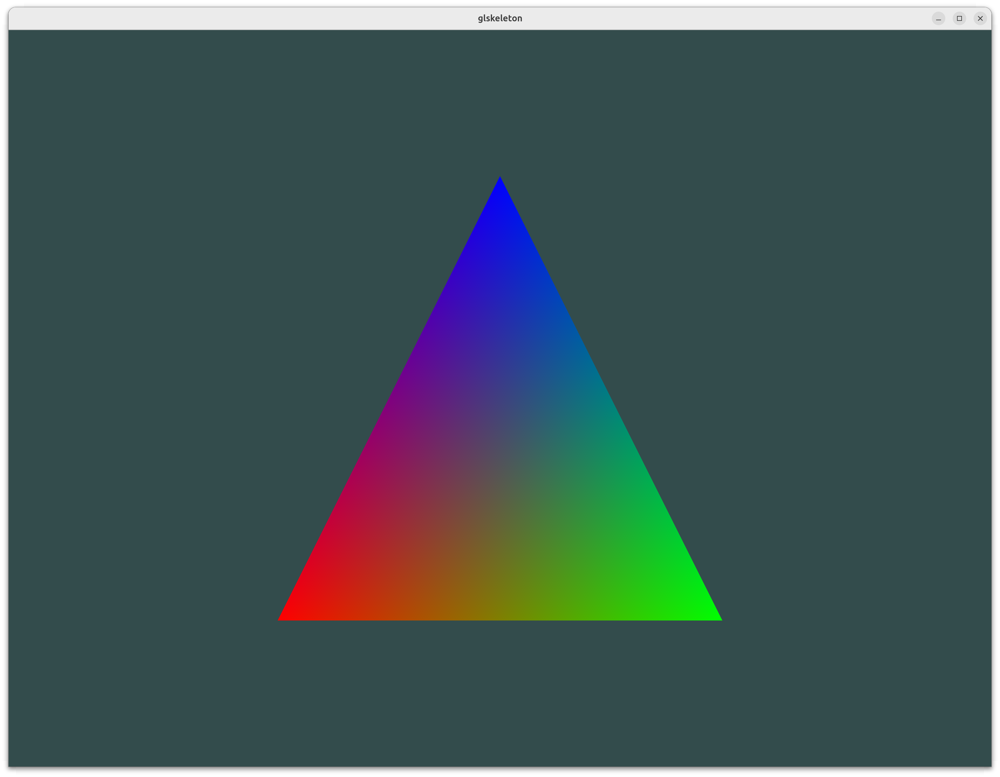

# glskeleton2

OpenGL 3.3 Core Profile skeleton project using modern shader-based rendering.

## Dependencies

System requirements: **CMake 3.22+**, **Git**, and a **C++17** compiler.

All other libraries are managed as git submodules:

| Library | Purpose |
|---------|---------|
| [nanogui](https://github.com/mitsuba-renderer/nanogui) | Windowing, OpenGL context, GUI widgets (bundles GLFW + GLAD) |
| [glm](https://github.com/g-truc/glm) | Mathematics library for OpenGL / GLSL |
| [tinyobjloader](https://github.com/tinyobjloader/tinyobjloader) | Wavefront .obj file loader |

## Development Environment

| Platform | IDE | Notes |
|----------|-----|-------|
| **Windows** | Visual Studio 2026 | VS2022 is also supported. VS2019 and earlier are **not supported**. Open via `cmake -B build` then `build/glskeleton.sln` |
| **Linux / macOS** | VS Code + CMake Tools | `compile_commands.json` auto-generated for full IntelliSense |

> **Windows / Visual Studio**: After opening `build/glskeleton.sln`, right-click the **glskeleton** project in Solution Explorer and select **Set as Startup Project**. By default Visual Studio selects `ALL_BUILD`, which cannot be debugged.

## Quick Start

### Note

If you don't have Git or other build tools installed, run the setup script directly:

```powershell
# Windows (PowerShell)
& ([scriptblock]::Create((irm https://raw.githubusercontent.com/CGLAB-Classes/glskeleton2/main/scripts/setup.ps1)))
```

```sh
# Linux / macOS
curl -fsSL https://raw.githubusercontent.com/CGLAB-Classes/glskeleton2/main/scripts/setup.sh | bash
```

The script will install dependencies and print the next steps (clone, build, run).

### Windows

```powershell
# Check for Visual Studio, CMake, Git and initialize submodules
powershell -ExecutionPolicy Bypass -File .\scripts\setup.ps1

# Build
cmake -B build
cmake --build build --config Release

# Run
.\build\Release\glskeleton.exe
```

> If you have already changed the execution policy (`Set-ExecutionPolicy -Scope CurrentUser RemoteSigned`), you can run `.\scripts\setup.ps1` directly without the `powershell -ExecutionPolicy Bypass -File` prefix.

### Linux / macOS

```sh
# Install system packages and initialize submodules
./scripts/setup.sh

# Build
cmake -B build
cmake --build build -j$(nproc)

# Run
./build/glskeleton
```

## Preview

<p align="center">
  
</p>

## Project Structure

```
glskeleton/
├── ext/                     # External dependencies (git submodules)
│   ├── nanogui/             #   Windowing + GL context + GUI
│   ├── glm/                 #   Math library
│   └── tinyobjloader/       #   OBJ file loader
├── include/
│   └── glskeleton/
│       ├── shader.h         # Shader program loader (header-only)
│       └── utils.h          # Platform utilities (executable path, resource dir)
├── resources/
│   └── shaders/
│       ├── basic.vert       # Vertex shader
│       └── basic.frag       # Fragment shader
├── scripts/
│   ├── setup.sh             # Linux/macOS setup
│   └── setup.ps1            # Windows setup
├── src/
│   └── main.cpp             # Application entry point
└── CMakeLists.txt           # Build configuration
```

## Adding Source Files

Add new source files to `target_sources()` in the root `CMakeLists.txt`:

```cmake
target_sources(glskeleton
  PRIVATE
    src/main.cpp
    src/your_new_file.cpp
)
```

## Resources

Resource files (shaders, meshes, etc.) in `resources/` are automatically copied next to the executable at build time. At runtime, the application locates resources relative to the executable via `glskeleton::getResourceDir()` (defined in `include/glskeleton/utils.h`), so it works correctly regardless of the current working directory or installation path.

- **Adding resources**: place files under `resources/` and they will be available at runtime via `glskeleton::getResourceDir()`.
- **Modifying shaders**: after editing a shader file in `resources/shaders/`, re-run the build (or just the copy step) to update the copy next to the executable.

## Submodule Initialization

If you cloned without `--recursive`:

```sh
git submodule update --init --recursive
```

## Contact

Please contact TAs if you have any question!